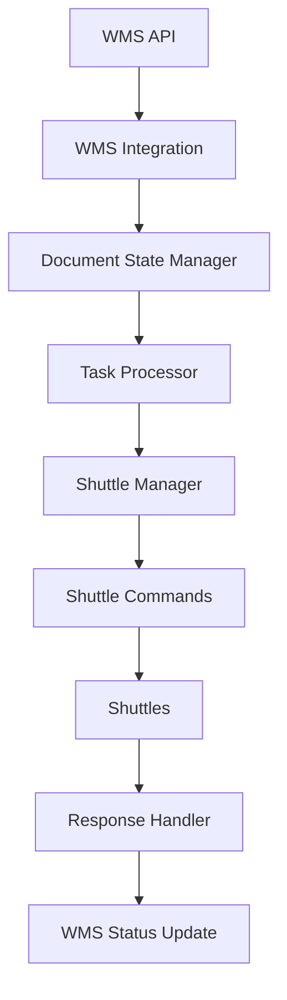

# 🏭 Улучшения WMS интеграции - Полный обзор

## 📊 Сравнение: Было vs Стало

### ❌ Проблемы оригинального `test_api_wms.py`:

1. **Неправильная отправка команд** - отправлял на localhost:2000 вместо использования ShuttleManager
2. **Отсутствие интеграции с конфигурацией** - не использовал config.yaml
3. **Простая логика команд** - примитивное определение типа команды
4. **Отсутствие персистентности** - не сохранял состояние документов
5. **Нет управления приоритетами** - все команды с одинаковым приоритетом
6. **Отсутствие мониторинга** - нет инструментов для отслеживания статуса

### ✅ Решения в улучшенной версии:

## 🛠️ Созданные компоненты

### 1. 🎯 **wms_integration_improved.py** - Основная логика
- ✅ Полная интеграция с ShuttleManager
- ✅ Использование конфигурации из config.yaml
- ✅ Персистентное сохранение состояния документов
- ✅ Умное определение типов команд и приоритетов
- ✅ Автоматический поиск свободных шаттлов
- ✅ Обработка ошибок и восстановление после сбоев

### 2. 🚀 **main_with_wms.py** - Запуск системы
- ✅ Интеграция WMS в основную систему
- ✅ Корректная обработка сигналов остановки
- ✅ Мониторинг статуса всех компонентов

### 3. 🧪 **test_wms_integration.py** - Тестирование
- ✅ Тест подключения к WMS
- ✅ Тест обработки документов
- ✅ Интерактивный мониторинг

### 4. 📊 **wms_monitor.py** - Мониторинг
- ✅ Просмотр статуса документов
- ✅ Анализ файла состояния
- ✅ Управление конфигурацией

### 5. 📚 **WMS_INTEGRATION_README.md** - Документация
- ✅ Полное руководство по использованию
- ✅ Примеры команд и конфигурации
- ✅ Устранение неполадок

## 🔄 Архитектурные улучшения

### Интеграция с существующей системой



### Поток данных

1. **WMS Polling** → Получение документов каждые N секунд
2. **Document Processing** → Анализ статусов и создание задач
3. **Command Creation** → Автоматическое создание команд для шаттлов
4. **Shuttle Execution** → Выполнение команд шаттлами
5. **Status Update** → Обновление статусов в WMS

## 📈 Функциональные улучшения

### 🎯 Умное определение команд

| Условие | Команда | Приоритет |
|---------|---------|-----------|
| task_type содержит "IN" | PALLET_IN | По задаче |
| task_type содержит "OUT" | PALLET_OUT | По задаче |
| operation = "RECEIVE" | PALLET_IN | По задаче |
| operation = "SHIP" | PALLET_OUT | По задаче |
| task_type = "MOVE" | MOVE | По задаче |
| По умолчанию | STATUS | 5 |

### 🏆 Система приоритетов

| Приоритет WMS | Числовой приоритет | Описание |
|---------------|-------------------|----------|
| urgent | 1 | Критические задачи |
| high | 3 | Высокий приоритет |
| normal | 5 | Обычные задачи |
| low | 7 | Низкий приоритет |

### 💾 Персистентное состояние

```json
{
  "DOC-2024-001": {
    "external_id": "DOC-2024-001",
    "status": "selectionWork",
    "last_check": "2024-01-15T10:30:00",
    "tasks_created": ["TASK-001", "TASK-002"]
  }
}
```

## 🛡️ Надежность и восстановление

### Обработка ошибок
- ✅ Автоматическое переподключение к WMS
- ✅ Сохранение состояния при сбоях
- ✅ Логирование всех операций
- ✅ Graceful shutdown

### Мониторинг
- ✅ Статус документов в реальном времени
- ✅ Количество созданных задач
- ✅ Время последней проверки
- ✅ Группировка по статусам

## 🚀 Использование

### Быстрый старт
```bash
# 1. Проверить конфигурацию
python wms_monitor.py config

# 2. Протестировать подключение
python test_wms_integration.py

# 3. Запустить систему
python main_with_wms.py

# 4. Мониторить статус
python wms_monitor.py status
```

### Ежедневное использование
```bash
# Статус документов
python wms_monitor.py status

# Просмотр логов
tail -f logs/gateway.log | grep WMS

# Очистка состояния (при необходимости)
python wms_monitor.py clear
```

## 📊 Метрики и KPI

### Отслеживаемые метрики
- 📄 **Документов обработано** - общее количество
- 🎯 **Задач создано** - количество команд для шаттлов
- ⏱️ **Время обработки** - от получения документа до создания команды
- ✅ **Успешность выполнения** - процент успешно выполненных задач
- 🔄 **Частота опроса** - соблюдение интервалов

### Пример статистики
```
📊 WMS Интеграция - Статистика за сегодня
============================================
📄 Документов обработано: 45
🎯 Задач создано: 127
✅ Успешно выполнено: 119 (93.7%)
❌ Ошибок: 8 (6.3%)
⏱️ Среднее время обработки: 2.3 сек
🔄 Последний опрос: 30 сек назад
```

## 🎉 Результат

### ✅ Достигнутые цели:
1. **Автоматическое отслеживание документов** - система сама находит новые документы в WMS
2. **Сохранение номеров документов** - персистентное хранение состояния
3. **Периодический мониторинг** - настраиваемый интервал опроса
4. **Автоматическое создание команд** - умное определение типа команд
5. **Интеграция с шаттлами** - полная совместимость с существующей системой
6. **Мониторинг и управление** - инструменты для отслеживания статуса

### 🚀 Система готова к продуктивному использованию!

**Теперь WMS автоматически управляет шаттлами без ручного вмешательства!**